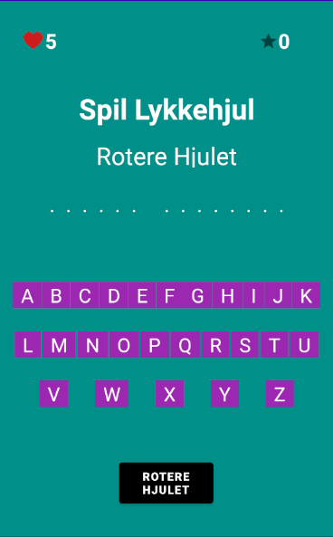
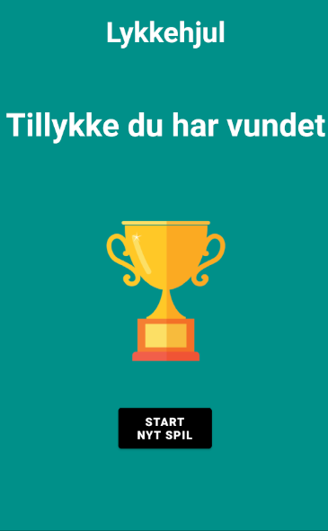
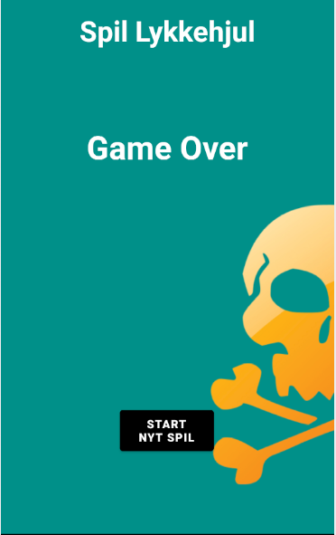

# Lykkehjul

# Recyclerview
Det hemmelig ord/sætinger er blevet vist ved at bruge recyclerview 

# Hvad handler spillet om

Handler om at gætte det hemmelig ord, man har 5 liv. 
Hver gang man rotere hjulet får man et random input f.eks points, tabtliv, ekstraliv eller konkurs, hvori de hverisær gør noget bestemt. 
Når man har 0 liv har man tabt spillet, mens hvis man gætter alle bogstaver i det hemmelig ord har man vundet. 

# Kategori

Det Hemmeligord man skal gætte er fodboldhold.

# Forside

Start side for spillet

# Spilet er vundet side

Hvis man vinder spillet kommer man til den her side.

# Spillet er tabt side

Hvis man taber spillet kommer man til den her side.
